# Design Document: AI Clinical Intelligence & Patient Monitoring Platform

## Overview

The AI Clinical Intelligence & Patient Monitoring Platform is a cloud-native healthcare system that provides comprehensive clinical intelligence across the patient lifecycle. The platform leverages AI, machine learning, and real-time data processing to support healthcare professionals with intelligent patient monitoring, predictive analytics, and automated escalation systems.

The system addresses critical healthcare challenges including fragmented patient information, information overload, manual monitoring dependencies, and time-critical clinical decision-making. It is designed as a microservices architecture deployed on AWS, integrating with existing hospital systems while providing modern web and mobile interfaces for healthcare professionals.

**Key Design Principles:**
- **Performance-First**: 2-second response times for real-time processing, 99.9% uptime
- **Security-by-Design**: AES-256 encryption, TLS 1.3, multi-factor authentication, HIPAA/GDPR compliance
- **Scalability**: Support for 1000+ concurrent patient monitoring sessions
- **Interoperability**: HL7 FHIR standards for EMR integration, DICOM/HL7 for device connectivity
- **AI-Driven Intelligence**: Continuous ML model improvement with 80% discharge prediction accuracy

## Architecture

### High-Level Architecture

```mermaid
graph TB
    subgraph "External Systems"
        EMR[EMR Systems]
        Devices[Medical Devices]
        Labs[Lab Systems]
    end
    
    subgraph "API Gateway Layer"
        Gateway[API Gateway]
        Auth[Authentication Service]
    end
    
    subgraph "Core Services"
        Profile[Patient Profile Service]
        Monitor[Monitoring Service]
        Escalation[Escalation Service]
        Reports[Reporting Service]
        Predict[Prediction Service]
        ML[ML Model Service]
    end
    
    subgraph "Data Layer"
        RDS[(Patient Data - RDS)]
        Dynamo[(Time Series - DynamoDB)]
        S3[(Documents - S3)]
        Vector[(Vector DB - OpenSearch)]
    end
    
    subgraph "AI/ML Layer"
        NLP[NLP Engine - Bedrock]
        RAG[RAG System]
        Models[ML Models - SageMaker]
    end
    
    subgraph "Notification Layer"
        SNS[SNS]
        SES[SES]
        Mobile[Mobile Push]
    end
    
    subgraph "Client Layer"
        Web[Web Dashboard]
        MobileApp[Mobile App]
        API[External APIs]
    end
    
    EMR --> Gateway
    Devices --> Gateway
    Labs --> Gateway
    
    Gateway --> Auth
    Gateway --> Profile
    Gateway --> Monitor
    Gateway --> Escalation
    Gateway --> Reports
    Gateway --> Predict
    
    Profile --> RDS
    Profile --> S3
    Profile --> NLP
    Profile --> RAG
    
    Monitor --> Dynamo
    Monitor --> Models
    Monitor --> Escalation
    
    Escalation --> SNS
    Escalation --> SES
    Escalation --> Mobile
    
    Reports --> RDS
    Reports --> Dynamo
    Reports --> Vector
    
    Predict --> Models
    Predict --> RDS
    Predict --> Dynamo
    
    ML --> Models
    ML --> Vector
    
    Web --> Gateway
    MobileApp --> Gateway
    API --> Gateway
```



### Technology Stack

**Cloud Infrastructure:**
- **AWS Lambda**: Serverless compute for microservices
- **API Gateway**: API management and routing
- **Application Load Balancer**: Traffic distribution
- **CloudFront**: Content delivery network

**Data Storage:**
- **Amazon RDS (PostgreSQL)**: Structured patient data, user management
- **DynamoDB**: Time-series vital signs data, real-time monitoring
- **S3**: Document storage, medical reports, images
- **OpenSearch**: Vector database for RAG system, clinical search

**AI/ML Services:**
- **Amazon Bedrock**: Large language models for NLP processing
- **SageMaker**: Custom ML model training and inference
- **Comprehend Medical**: Medical entity extraction
- **Textract**: Document text extraction

**Integration & Messaging:**
- **SNS**: Push notifications and alerts
- **SES**: Email notifications
- **EventBridge**: Event-driven architecture
- **Kinesis**: Real-time data streaming

## Components and Interfaces

### 1. Patient Profile Service

**Responsibilities:**
- Process and analyze medical documents using NLP
- Generate comprehensive patient profiles
- Manage patient demographic and clinical data
- Handle new patient onboarding

**Key Interfaces:**
```typescript
interface PatientProfileService {
  createProfile(patientData: PatientData): Promise<PatientProfile>
  updateProfile(patientId: string, updates: ProfileUpdate): Promise<PatientProfile>
  getProfile(patientId: string): Promise<PatientProfile>
  processDocuments(patientId: string, documents: Document[]): Promise<ClinicalInsights>
  establishBaseline(patientId: string, vitalSigns: VitalSigns): Promise<BaselineProfile>
}

interface PatientProfile {
  patientId: string
  demographics: Demographics
  medicalHistory: MedicalHistory[]
  currentMedications: Medication[]
  allergies: Allergy[]
  clinicalSummary: string
  riskFactors: RiskFactor[]
  baselineVitals: VitalRanges
  createdAt: Date
  updatedAt: Date
}
```

### 2. Real-time Monitoring Service

**Responsibilities:**
- Collect and process real-time vital signs
- Analyze time-series data for pattern detection
- Identify deterioration patterns and anomalies
- Maintain patient monitoring state

**Key Interfaces:**
```typescript
interface MonitoringService {
  ingestVitalSigns(patientId: string, vitals: VitalSigns): Promise<void>
  analyzePatientTrends(patientId: string): Promise<TrendAnalysis>
  detectAnomalies(patientId: string, timeWindow: TimeWindow): Promise<Anomaly[]>
  getMonitoringStatus(patientId: string): Promise<MonitoringStatus>
  updateMonitoringRules(patientId: string, rules: MonitoringRules): Promise<void>
}

interface VitalSigns {
  patientId: string
  timestamp: Date
  bloodPressure: BloodPressure
  heartRate: number
  oxygenSaturation: number
  temperature: number
  respiratoryRate: number
  labValues?: LabValue[]
}

interface TrendAnalysis {
  patientId: string
  trends: VitalTrend[]
  deteriorationScore: number
  riskLevel: RiskLevel
  recommendations: string[]
}
```

### 3. Intelligent Escalation Service

**Responsibilities:**
- Evaluate patient condition severity
- Route alerts to appropriate healthcare professionals
- Track alert acknowledgments and escalations
- Manage notification preferences

**Key Interfaces:**
```typescript
interface EscalationService {
  evaluateSeverity(patientId: string, anomaly: Anomaly): Promise<SeverityLevel>
  triggerAlert(alert: Alert): Promise<AlertResponse>
  acknowledgeAlert(alertId: string, userId: string): Promise<void>
  escalateUnacknowledged(): Promise<void>
  updateNotificationRules(rules: NotificationRules): Promise<void>
}

interface Alert {
  alertId: string
  patientId: string
  severity: SeverityLevel
  message: string
  recipients: Recipient[]
  escalationPath: EscalationPath
  createdAt: Date
}

enum SeverityLevel {
  LOW = "low",
  MEDIUM = "medium", 
  HIGH = "high",
  CRITICAL = "critical"
}
```

### 4. Clinical Reporting Service

**Responsibilities:**
- Generate periodic clinical reports
- Aggregate patient data and trends
- Provide treatment recommendations
- Support custom report configurations

**Key Interfaces:**
```typescript
interface ReportingService {
  generateDailyReport(patientId: string): Promise<ClinicalReport>
  generateCustomReport(patientId: string, config: ReportConfig): Promise<ClinicalReport>
  getReportHistory(patientId: string, dateRange: DateRange): Promise<ClinicalReport[]>
  scheduleReport(schedule: ReportSchedule): Promise<void>
}

interface ClinicalReport {
  reportId: string
  patientId: string
  reportType: ReportType
  generatedAt: Date
  summary: ClinicalSummary
  vitalTrends: VitalTrend[]
  alerts: AlertSummary[]
  recommendations: Recommendation[]
  medicationAdherence: MedicationAdherence
}
```

### 5. Predictive Analytics Service

**Responsibilities:**
- Predict patient recovery timelines
- Estimate discharge dates
- Identify readmission risks
- Support resource planning

**Key Interfaces:**
```typescript
interface PredictiveService {
  predictDischarge(patientId: string): Promise<DischargePrediction>
  assessReadmissionRisk(patientId: string): Promise<ReadmissionRisk>
  predictRecoveryTrend(patientId: string): Promise<RecoveryPrediction>
  generateCapacityForecast(wardId: string, timeHorizon: number): Promise<CapacityForecast>
}

interface DischargePrediction {
  patientId: string
  estimatedDischargeDate: Date
  confidence: number
  factors: PredictionFactor[]
  recommendations: string[]
}
```

### 6. ML Model Management Service

**Responsibilities:**
- Manage ML model lifecycle
- Perform model training and validation
- Handle model deployment and rollback
- Monitor model performance

**Key Interfaces:**
```typescript
interface MLModelService {
  trainModel(modelType: ModelType, trainingData: TrainingData): Promise<ModelVersion>
  deployModel(modelId: string, version: string): Promise<DeploymentResult>
  validateModel(modelId: string, validationData: ValidationData): Promise<ValidationResult>
  rollbackModel(modelId: string, previousVersion: string): Promise<void>
  getModelMetrics(modelId: string): Promise<ModelMetrics>
}
```

## Data Models

### Core Entities

```typescript
interface Patient {
  patientId: string
  mrn: string // Medical Record Number
  demographics: Demographics
  admissionDate: Date
  dischargeDate?: Date
  wardId: string
  assignedStaff: StaffAssignment[]
  status: PatientStatus
}

interface Demographics {
  firstName: string
  lastName: string
  dateOfBirth: Date
  gender: Gender
  contactInfo: ContactInfo
  emergencyContact: EmergencyContact
  insurance: InsuranceInfo
}

interface MedicalHistory {
  conditionId: string
  condition: string
  diagnosisDate: Date
  severity: string
  status: ConditionStatus
  notes: string
}

interface VitalSignsRecord {
  recordId: string
  patientId: string
  timestamp: Date
  deviceId?: string
  vitals: VitalSigns
  qualityScore: number
  flags: string[]
}

interface Alert {
  alertId: string
  patientId: string
  type: AlertType
  severity: SeverityLevel
  message: string
  triggeredBy: string
  triggeredAt: Date
  acknowledgedBy?: string
  acknowledgedAt?: Date
  resolvedAt?: Date
  escalationLevel: number
}
```

### Time-Series Data Structure

```typescript
interface TimeSeriesVitals {
  partitionKey: string // patientId#date
  sortKey: string // timestamp
  patientId: string
  timestamp: number
  vitals: {
    heartRate?: number
    bloodPressure?: BloodPressure
    oxygenSaturation?: number
    temperature?: number
    respiratoryRate?: number
  }
  deviceMetadata: DeviceMetadata
  qualityFlags: QualityFlag[]
}
```

Now I need to use the prework tool to analyze the acceptance criteria before writing the Correctness Properties section.

<function_calls>
<invoke name="prework">
<parameter name="featureName">ai-clinical-intelligence-platform

## Correctness Properties

*A property is a characteristic or behavior that should hold true across all valid executions of a system—essentially, a formal statement about what the system should do. Properties serve as the bridge between human-readable specifications and machine-verifiable correctness guarantees.*

### Property 1: Document Processing and Insight Extraction
*For any* medical document (report, prescription, clinical history) in supported formats (PDF, DOCX, image), the NLP engine should successfully extract relevant medical entities and generate appropriate clinical insights
**Validates: Requirements 1.1, 1.2, 1.3, 1.9**

### Property 2: Patient Profile Generation Performance
*For any* patient data (with or without historical records), the system should generate a comprehensive patient profile within 5 minutes of document upload or patient registration
**Validates: Requirements 1.5**

### Property 3: Critical Information Highlighting
*For any* generated patient profile, critical medical conditions and allergies should be prominently highlighted when available in the source data
**Validates: Requirements 1.6**

### Property 4: RAG System Contextual Insights
*For any* patient with available clinical data, the RAG system should provide relevant contextual medical insights based on that patient's specific information
**Validates: Requirements 1.8**

### Property 5: Vital Signs Collection and Storage
*For any* vital signs received from connected medical devices, the monitoring agent should store them with accurate timestamps in the patient record
**Validates: Requirements 2.1, 2.2**

### Property 6: Real-time Analysis Frequency
*For any* patient under monitoring, the system should analyze their time-series clinical data every 30 seconds
**Validates: Requirements 2.3**

### Property 7: Deterioration Pattern Detection
*For any* abnormal vital sign patterns detected, the monitoring agent should identify deterioration patterns within 2 minutes
**Validates: Requirements 2.4**

### Property 8: Individual Patient Baselines
*For any* patient, the monitoring agent should maintain personalized baseline vital ranges specific to that individual
**Validates: Requirements 2.5**

### Property 9: Lab Value Correlation
*For any* integrated lab values, the monitoring agent should correlate them with corresponding vital sign trends for the same patient
**Validates: Requirements 2.6**

### Property 10: Real-time Dashboard Updates
*For any* patient status change, the clinical intelligence platform should reflect the current status in real-time dashboards
**Validates: Requirements 2.7**

### Property 11: Severity Level Classification
*For any* deterioration pattern identified, the escalation system should determine an appropriate severity level based on clinical criteria
**Validates: Requirements 3.1**

### Property 12: Severity-Based Notification Routing
*For any* alert with a specific severity level, the escalation system should notify the appropriate healthcare professionals according to the defined escalation matrix within specified timeframes
**Validates: Requirements 3.2, 3.3, 3.4, 3.5**

### Property 13: Alert Acknowledgment Tracking
*For any* triggered alert, the escalation system should track acknowledgment status and escalate further if not acknowledged within defined timeframes
**Validates: Requirements 3.6**

### Property 14: Multi-patient Alert Prioritization
*For any* situation with multiple concurrent patient alerts, the escalation system should prioritize notifications based on severity levels
**Validates: Requirements 3.7**

### Property 15: Daily Clinical Report Generation
*For any* patient in the system, a daily clinical report should be generated containing their clinical status and progress
**Validates: Requirements 4.1**

### Property 16: Comprehensive Report Content
*For any* generated clinical report, it should include vital sign trends, escalation summaries, and medication adherence analysis for the specified time period
**Validates: Requirements 4.2, 4.3, 4.6**

### Property 17: Treatment Recommendations
*For any* patient's current condition, the clinical intelligence platform should provide relevant treatment recommendations based on clinical guidelines
**Validates: Requirements 4.4**

### Property 18: Interim Report Generation
*For any* significant patient condition change, the system should generate interim reports to alert healthcare professionals
**Validates: Requirements 4.5**

### Property 19: Report Customization
*For any* healthcare professional, the system should allow customization of report frequency and content based on their role and preferences
**Validates: Requirements 4.7**

### Property 20: Recovery Pattern Analysis
*For any* patient with sufficient historical data, the system should analyze recovery patterns to support clinical decision-making
**Validates: Requirements 5.1**

### Property 21: Discharge Timeline Prediction
*For any* patient with sufficient data, the system should predict discharge timeline with at least 80% accuracy
**Validates: Requirements 5.2**

### Property 22: Resource Requirement Estimation
*For any* patient condition trends, the system should estimate appropriate resource requirements for optimal care
**Validates: Requirements 5.3**

### Property 23: Discharge Priority Recommendations
*For any* situation where bed capacity approaches limits, the system should recommend discharge priorities based on clinical criteria
**Validates: Requirements 5.4**

### Property 24: Readmission Risk Identification
*For any* patient, the system should identify those at risk of readmission within 30 days based on clinical indicators
**Validates: Requirements 5.5**

### Property 25: Ward-level Analytics
*For any* hospital ward, the system should provide analytics for capacity planning and resource optimization
**Validates: Requirements 5.6**

### Property 26: Seasonal Pattern Adjustment
*For any* detected seasonal patterns in patient data, the system should adjust predictions accordingly to maintain accuracy
**Validates: Requirements 5.7**

### Property 27: EMR Integration Standards Compliance
*For any* EMR system integration, the platform should use HL7 FHIR standards for data exchange
**Validates: Requirements 6.1**

### Property 28: Medical Device Protocol Support
*For any* medical device connection, the platform should support standard protocols (DICOM, HL7) for data communication
**Validates: Requirements 6.2**

### Property 29: Bidirectional Data Synchronization
*For any* patient data, the platform should maintain bidirectional synchronization with EMR systems
**Validates: Requirements 6.3**

### Property 30: Data Conflict Detection
*For any* data conflicts between systems, the platform should flag discrepancies for manual review
**Validates: Requirements 6.4**

### Property 31: Cross-system Data Consistency
*For any* patient data across integrated systems, the platform should maintain consistency and integrity
**Validates: Requirements 6.5**

### Property 32: Real-time Data Streaming
*For any* monitoring device, the platform should support real-time data streaming capabilities
**Validates: Requirements 6.6**

### Property 33: System Resilience
*For any* system integration failure, the platform should continue operating with cached data and alert administrators
**Validates: Requirements 6.7**

### Property 34: Comprehensive Data Encryption
*For any* patient data, the platform should encrypt it using AES-256 at rest and TLS 1.3 in transit
**Validates: Requirements 7.1, 7.2**

### Property 35: Multi-factor Authentication
*For any* healthcare professional accessing patient data, the platform should require multi-factor authentication
**Validates: Requirements 7.3**

### Property 36: Comprehensive Audit Logging
*For any* data access or modification, the platform should maintain comprehensive audit logs
**Validates: Requirements 7.4**

### Property 37: Data Lifecycle Management
*For any* patient data with expired retention periods, the platform should automatically archive or delete the data
**Validates: Requirements 7.6**

### Property 38: Role-based Access Control
*For any* user and any data, the platform should implement role-based access control limiting access to authorized personnel only
**Validates: Requirements 7.7**

### Property 39: Real-time Processing Performance
*For any* real-time vital signs processing, the platform should respond within 2 seconds
**Validates: Requirements 8.2**

### Property 40: Automated Backup and Recovery
*For any* system data, the platform should perform automated backups every 4 hours with point-in-time recovery capability
**Validates: Requirements 8.7**

### Property 41: Cross-device Dashboard Accessibility
*For any* device (desktop, tablet, mobile), the platform should provide accessible web-based dashboards
**Validates: Requirements 9.1**

### Property 42: Prominent Alert Display
*For any* triggered alert, the platform should display it prominently with clear visual indicators
**Validates: Requirements 9.2**

### Property 43: Multi-platform Mobile Support
*For any* mobile platform (iOS, Android), the platform should provide native application support
**Validates: Requirements 9.3**

### Property 44: Priority-based Information Organization
*For any* patient data display, the platform should organize information by priority and relevance
**Validates: Requirements 9.4**

### Property 45: Role-based Dashboard Customization
*For any* healthcare professional role, the platform should provide customizable dashboard layouts
**Validates: Requirements 9.5**

### Property 46: Voice Command Support
*For any* clinical setting, the platform should support voice commands for hands-free operation
**Validates: Requirements 9.6**

### Property 47: Efficient Patient Management
*For any* healthcare professional with multiple assigned patients, the platform should provide efficient patient switching and search capabilities
**Validates: Requirements 9.7**

### Property 48: Continuous ML Model Training
*For any* anonymized patient data, the platform should continuously train ML models to improve predictions
**Validates: Requirements 10.1**

### Property 49: ML Model Performance Validation
*For any* ML model, the platform should validate performance against clinical outcomes
**Validates: Requirements 10.3**

### Property 50: ML Model Lifecycle Management
*For any* ML model deployment, the platform should support A/B testing, performance monitoring, and clinical validation requirements
**Validates: Requirements 10.4, 10.5, 10.7**

### Property 51: Explainable AI Insights
*For any* clinical decision support, the platform should provide explainable AI insights that healthcare professionals can understand and trust
**Validates: Requirements 10.6**

## Error Handling

### Error Categories and Strategies

**1. Data Integration Errors**
- **EMR Connection Failures**: Implement circuit breaker pattern with exponential backoff
- **Device Communication Errors**: Maintain local caching and retry mechanisms
- **Data Format Inconsistencies**: Provide data validation and transformation layers

**2. AI/ML Processing Errors**
- **NLP Processing Failures**: Fallback to rule-based extraction methods
- **Model Prediction Errors**: Implement confidence thresholds and human review triggers
- **Vector Search Failures**: Provide alternative search mechanisms

**3. Real-time Monitoring Errors**
- **Vital Signs Data Loss**: Implement data buffering and recovery mechanisms
- **Alert System Failures**: Provide multiple notification channels and escalation paths
- **Performance Degradation**: Implement auto-scaling and load balancing

**4. Security and Compliance Errors**
- **Authentication Failures**: Implement secure session management and audit logging
- **Data Breach Detection**: Provide real-time monitoring and incident response
- **Compliance Violations**: Implement automated compliance checking and reporting

### Error Recovery Mechanisms

```typescript
interface ErrorHandler {
  handleDataIntegrationError(error: DataIntegrationError): Promise<RecoveryAction>
  handleMLProcessingError(error: MLProcessingError): Promise<RecoveryAction>
  handleMonitoringError(error: MonitoringError): Promise<RecoveryAction>
  handleSecurityError(error: SecurityError): Promise<RecoveryAction>
}

enum RecoveryAction {
  RETRY_WITH_BACKOFF = "retry_with_backoff",
  FALLBACK_TO_CACHE = "fallback_to_cache",
  ESCALATE_TO_HUMAN = "escalate_to_human",
  TRIGGER_EMERGENCY_PROTOCOL = "trigger_emergency_protocol"
}
```

## Testing Strategy

### Dual Testing Approach

The AI Clinical Intelligence Platform requires both unit testing and property-based testing to ensure comprehensive coverage and correctness:

**Unit Tests:**
- Focus on specific examples, edge cases, and error conditions
- Test integration points between microservices
- Validate specific clinical scenarios and workflows
- Test security and compliance requirements
- Verify API contracts and data transformations

**Property-Based Tests:**
- Verify universal properties across all inputs using randomized data
- Test system behavior with various patient data combinations
- Validate ML model consistency and performance
- Ensure data integrity across all operations
- Test scalability and performance characteristics

### Property-Based Testing Configuration

**Testing Framework:** Use Hypothesis (Python) or fast-check (TypeScript/JavaScript) for property-based testing
**Test Configuration:**
- Minimum 100 iterations per property test
- Each property test must reference its design document property
- Tag format: **Feature: ai-clinical-intelligence-platform, Property {number}: {property_text}**

**Example Property Test Structure:**
```python
@given(patient_data=patient_data_strategy())
def test_patient_profile_generation_performance(patient_data):
    """
    Feature: ai-clinical-intelligence-platform, Property 2: Patient Profile Generation Performance
    For any patient data, the system should generate a comprehensive patient profile within 5 minutes
    """
    start_time = time.time()
    profile = patient_profile_service.create_profile(patient_data)
    end_time = time.time()
    
    assert profile is not None
    assert profile.patient_id == patient_data.patient_id
    assert (end_time - start_time) < 300  # 5 minutes
```

### Testing Coverage Areas

**1. Clinical Data Processing**
- Document parsing and NLP extraction accuracy
- Medical entity recognition and classification
- Clinical insight generation and relevance

**2. Real-time Monitoring**
- Vital signs data ingestion and storage
- Pattern detection and anomaly identification
- Performance under high-frequency data streams

**3. Escalation and Alerting**
- Severity classification accuracy
- Notification routing and timing
- Alert acknowledgment and escalation logic

**4. Predictive Analytics**
- Discharge prediction accuracy and confidence
- Readmission risk assessment validation
- Resource planning recommendation quality

**5. Integration and Interoperability**
- EMR system integration reliability
- Medical device communication protocols
- Data synchronization and consistency

**6. Security and Compliance**
- Authentication and authorization mechanisms
- Data encryption and audit logging
- HIPAA and GDPR compliance validation

### Performance Testing Requirements

**Load Testing:**
- Simulate up to 1000 concurrent patient monitoring sessions
- Test API response times under various load conditions
- Validate auto-scaling behavior and resource utilization

**Stress Testing:**
- Test system behavior under extreme data volumes
- Validate graceful degradation under resource constraints
- Test recovery mechanisms after system failures

**Security Testing:**
- Penetration testing for vulnerability assessment
- Authentication and authorization testing
- Data encryption and transmission security validation